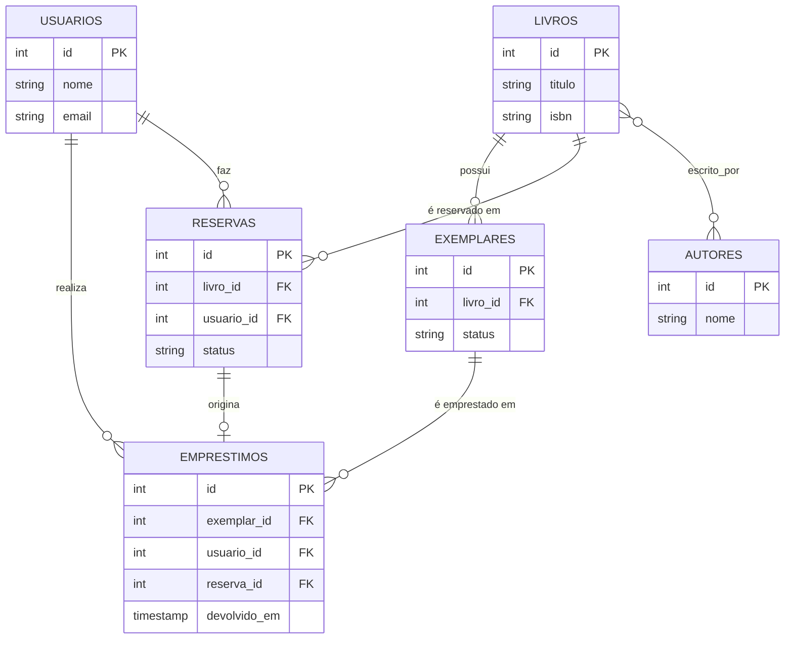

# Sistema de Empréstimo de Biblioteca

Schema relacional em PostgreSQL para uma biblioteca: catálogo de livros, exemplares
físicos, empréstimos e fila de reservas.

## Modelo de dados



## Regras garantidas pelo schema

- Um exemplar tem no máximo um empréstimo em aberto por vez (índice único parcial).
- Exemplar perdido/danificado muda de status — nunca é excluído, preservando histórico.
- Um usuário não pode ter duas reservas ativas do mesmo título.
- Livros, usuários e exemplares com histórico não podem ser excluídos (`ON DELETE RESTRICT`).

## Decisões principais

**Disponibilidade derivada, não armazenada.** Em vez de uma coluna `disponivel`, a
disponibilidade de um exemplar é calculada pela ausência de um empréstimo aberto:

```sql
CREATE UNIQUE INDEX uk_exemplar_emprestado
    ON emprestimos(exemplar_id)
    WHERE devolvido_em IS NULL;
```

**Reserva rastreável.** `emprestimos.reserva_id` (opcional) registra quando um
empréstimo veio de uma reserva atendida.

## Limitação conhecida (schema)

O schema não garante que `emprestimos.reserva_id` aponte para uma reserva do mesmo
usuário e do mesmo livro — PostgreSQL não permite `CHECK` entre tabelas. Essa
validação fica na camada de aplicação, e não em um trigger: é uma regra do fluxo de
negócio "atender reserva", não uma regra de integridade de dado.

> **Resolvida na Etapa 3** — ver seção abaixo. A regra agora é garantida em código,
> no construtor da entidade `Emprestimo`.

## Testado localmente

Todas as constraints acima foram validadas com dados reais via `psql` (PostgreSQL 18.4):
reserva duplicada bloqueada, empréstimo de exemplar já emprestado bloqueado, devolução
anterior ao empréstimo bloqueada. O cenário da limitação conhecida (reserva de um
usuário usada em empréstimo de outro) foi reproduzido e confirmado — o INSERT passa
sem erro, como esperado dado que o banco não garante essa regra sozinho.

## Como executar o schema

```bash
psql -U seu_usuario -d seu_banco -f biblioteca_schema.sql
```

---

# Etapa 3 — Arquitetura e DDD (Python)

Camada de aplicação em Python sobre o schema acima, seguindo Clean Architecture: o
domínio não depende de nada externo (nem de banco, nem de framework), e as
dependências externas (Postgres) ficam isoladas numa camada própria.

## Estrutura

```
arquitetura/
├── dominio/
│   ├── usuario.py           # Entidade Usuario
│   ├── livro.py              # Entidade Livro
│   ├── exemplar.py           # Entidade Exemplar
│   ├── reserva.py            # Entidade Reserva
│   ├── emprestimo.py         # Entidade Emprestimo + invariante central
│   └── repositorios.py       # Interfaces abstratas (contratos)
├── aplicacao/
│   └── criar_emprestimo.py   # Caso de uso: orquestra repositórios + domínio
├── infraestrutura/
│   └── repositorios_postgres.py  # Implementação real dos contratos, com SQL
└── +└── teste/
     └── test_criar_emprestimo.py  # Prova automatizada da invariante
```

A seta de dependência aponta sempre para dentro: `infraestrutura` e `aplicacao`
dependem de `dominio`; `dominio` não depende de nada.

## Invariante central

A limitação documentada na Etapa 2 — nada impedia que `emprestimos.reserva_id`
apontasse para uma reserva de outro usuário ou de outro livro — é resolvida no
construtor da entidade `Emprestimo` (`dominio/emprestimo.py`). Se a reserva não
pertencer ao mesmo `usuario_id` e `livro_id` do empréstimo, ou não estiver com status
`PENDENTE`/`AGUARDANDO_RETIRADA`, a criação do objeto falha com `ValueError` — o
empréstimo inconsistente nunca chega a ser persistido.

## Rodando os testes

```bash
 cd arquitetura
 pip install pytest
+python -m pytest teste/ -v
```

7 testes cobrem: criação sem reserva, criação com reserva coerente, reserva de outro
usuário, reserva de outro livro, reserva cancelada, reserva já atendida, e exemplar já
emprestado. Validado localmente — todos passando.


---

# Etapa 4 — Design Patterns (Strategy)

## Problema

`CriarEmprestimo` calculava o prazo de devolução com um `prazo_padrao_dias: int`
fixo. Qualquer regra nova de prazo viraria `if/else` acumulado dentro do caso de
uso, misturando lógica de negócio com orquestração.

## Solução: Strategy

`dominio/politica_prazo.py` define a interface `PoliticaPrazo` e duas
implementações:

- `PrazoPadrao` — 14 dias fixos (comportamento original).
- `PrazoComFilaDeReserva` — encurta para 7 dias quando existe reserva pendente de
  outro usuário para o mesmo livro, liberando o exemplar mais rápido pra quem
  está na fila.

`CriarEmprestimo` recebe a estratégia por injeção de dependência — não sabe qual
está em uso, só chama `calcular_dias(usuario_id, livro_id)`.

**Por que "fila de reserva" e não "tipo de usuário":** o domínio não tem conceito
de tipo/categoria de usuário hoje. Aplicar Strategy em cima de um campo que não
existe seria especulação. A fila de reserva já é uma regra de negócio real e
modelada desde a Etapa 2.

## Dependência gerada

`PrazoComFilaDeReserva` precisa perguntar se há reserva pendente para um livro —
isso exigiu um método novo no contrato do repositório:

- `dominio/repositorios.py` — `RepositorioReserva.existe_reserva_pendente_para_livro`
  (abstrato).
- `infraestrutura/repositorios_postgres.py` — implementação com SQL real.
- `teste/test_criar_emprestimo.py` — fake em memória do mesmo método.

## Testado localmente

9 testes (os 7 da Etapa 3 + 2 novos: prazo encurta com fila, prazo padrão sem
fila). Todos passando — confirma que a troca de estratégia não quebrou a
invariante reserva/usuário/livro validada na Etapa 3.