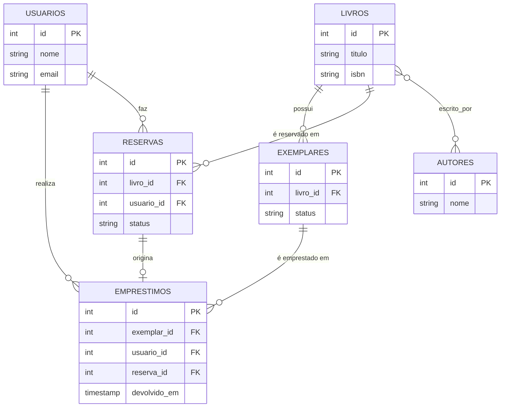

# Sistema de Empréstimo de Biblioteca

Sistema de gestão de biblioteca construído incrementalmente como projeto de
portfólio: parte de um schema relacional em PostgreSQL e evolui, etapa por etapa,
até uma arquitetura com camadas desacopladas (Clean Architecture/DDD), um serviço
extraído como microsserviço, processamento assíncrono com cache, e uma interface
web em React consumindo a API. Cada etapa abaixo documenta o problema, a decisão
tomada — incluindo alternativas descartadas — e a validação local com dados reais.

**Stack:** PostgreSQL · Python · TypeScript · FastAPI · Celery · Redis · React · Vite · Pytest · Vitest

## Índice

- [Estrutura do Repositório](#estrutura-do-repositório)
- [Como Rodar (Geral)](#como-rodar-geral)
- [Etapa 2 — Modelo de Dados](#etapa-2--modelo-de-dados)
- [Etapa 3 — Arquitetura e DDD (Python)](#etapa-3--arquitetura-e-ddd-python)
- [Etapa 4 — Design Patterns (Strategy)](#etapa-4--design-patterns-strategy)
- [Etapa 5 — TypeScript](#etapa-5--typescript)
- [Etapa 6 — Microsserviços](#etapa-6--microsserviços)
- [Etapa 7 — Processamento Assíncrono e Cache](#etapa-7--processamento-assíncrono-e-cache)
- [Etapa 8 — React (Fatia 1: Disponibilidade)](#etapa-8--react-fatia-1-disponibilidade)
- [Etapa 9 — CI/CD e Testes Automatizados](#etapa-9--cicd-e-testes-automatizados)

## Estrutura do Repositório

```text
.
├── api/                    # Pontos de entrada da API principal (FastAPI)
├── arquitetura/            # Backend principal (Clean Architecture, casos de uso, domínio)
├── servico-prazo/          # Microsserviço FastAPI de cálculo de prazo (Etapa 6)
├── politica-prazo-ts/      # Módulo TypeScript de política de prazo (Etapa 5)
├── frontend/               # Interface web em React, TypeScript e Vite (Etapa 8)
└── .github/workflows/      # Pipeline de CI/CD automatizado (Etapa 9)
```

## Como Rodar (Geral)

**Pré-requisitos:** PostgreSQL e Redis disponíveis (local ou em contêiner) e um
arquivo `.env` na raiz com as variáveis de ambiente.

```bash
# Microsserviço de prazo
cd servico-prazo && uvicorn main:app --reload --port 8001

# API principal (na raiz do repositório)
uvicorn api.main:app --reload --port 8000

# Frontend
cd frontend && npm install && npm run dev
```

# Etapa 2 — Modelo de Dados



### Regras garantidas pelo schema

- Um exemplar tem no máximo um empréstimo em aberto por vez (índice único parcial).
- Exemplar perdido/danificado muda de status — nunca é excluído, preservando histórico.
- Um usuário não pode ter duas reservas ativas do mesmo título.
- Livros, usuários e exemplares com histórico não podem ser excluídos (`ON DELETE RESTRICT`).

### Decisão: disponibilidade derivada, não armazenada

Em vez de uma coluna `disponivel`, a disponibilidade de um exemplar é calculada pela
ausência de um empréstimo aberto:

```sql
CREATE UNIQUE INDEX uk_exemplar_emprestado
    ON emprestimos(exemplar_id)
    WHERE devolvido_em IS NULL;
```

`emprestimos.reserva_id` (opcional) registra quando um empréstimo veio de uma
reserva atendida.

### ⚠️ Limitações Conhecidas (Schema)

O schema não garante que `emprestimos.reserva_id` aponte para uma reserva do mesmo
usuário e do mesmo livro — PostgreSQL não permite `CHECK` entre tabelas. Essa
validação fica na camada de aplicação, não em um trigger: é uma regra do fluxo de
negócio "atender reserva", não uma regra de integridade de dado.

> **Resolvida na Etapa 3** — ver seção abaixo, garantida em código no construtor da
> entidade `Emprestimo`.

### Testado localmente

Constraints validadas com dados reais via `psql` — reserva
duplicada, empréstimo de exemplar já emprestado e devolução retroativa bloqueados;
o cenário da limitação conhecida foi reproduzido de propósito e confirmou a lacuna.

```bash
psql -U seu_usuario -d seu_banco -f biblioteca_schema.sql
```

---

# Etapa 3 — Arquitetura e DDD (Python)

### Problema

A limitação da Etapa 2 — `emprestimos.reserva_id` pode apontar para uma reserva de
outro usuário ou de outro livro, e o banco não consegue impedir isso — precisa de uma
camada onde a regra de fluxo "atender reserva" possa ser garantida.

### Solução

Camada de aplicação em Python sobre o schema acima, seguindo Clean Architecture: o
domínio não depende de nada externo (nem de banco, nem de framework); as
dependências externas (Postgres) ficam isoladas numa camada própria.

#### Estrutura

```
arquitetura/
├── dominio/
│   ├── __init__.py
│   ├── emprestimo.py         # Entidade Emprestimo + invariante central
│   ├── exemplar.py           # Entidade Exemplar
│   ├── livro.py              # Entidade Livro
│   ├── politica_prazo.py     # Interface / Regras de política de prazo
│   ├── repositorios.py       # Interfaces abstratas (contratos)
│   ├── reserva.py            # Entidade Reserva
│   └── usuario.py            # Entidade Usuario
├── aplicacao/
│   ├── __init__.py
│   ├── consultar_disponibilidade.py  # Caso de uso de consulta
│   ├── criar_emprestimo.py           # Caso de uso: orquestra repositórios + domínio
│   ├── devolver_exemplar.py          # Caso de uso de devolução
│   └── expirar_reservas_pendentes.py # Caso de uso de expiração de reservas
├── infraestrutura/
│   ├── repositorios_postgres.py      # Implementação real dos contratos, com SQL
│   ├── politica_prazo_remota.py      # Cliente do microsserviço de prazo (Etapa 6)
│   └── tasks.py                      # Tarefas Celery (Etapa 7)
└── teste/
    ├── __init__.py
    ├── test_criar_emprestimo.py      # Prova automatizada da invariante
    ├── testar_expiracao_manual.py    # Teste manual/automatizado de expiração
    └── teste_integracao_prazo_remoto.py # Teste do microsserviço remoto
```

Os componentes de cache e de agendamento (`RepositorioExemplarCache`,
`celery_app.py`) são descritos na Etapa 7.


A seta de dependência aponta sempre para dentro: `infraestrutura` e `aplicacao`
dependem de `dominio`; `dominio` não depende de nada.

#### Invariante central

A limitação da Etapa 2 é resolvida no construtor de `Emprestimo`
(`dominio/emprestimo.py`): se a reserva não pertencer ao mesmo `usuario_id` e
`livro_id` do empréstimo, ou não estiver `PENDENTE`/`AGUARDANDO_RETIRADA`, a criação
do objeto falha com `ValueError` — o empréstimo inconsistente nunca chega a ser
persistido.

### Testado localmente

7 testes (`pytest teste/ -v`) cobrindo criação com/sem
reserva, reserva de outro usuário, outro livro, cancelada, já atendida, e exemplar
já emprestado. Todos passando.

---

# Etapa 4 — Design Patterns (Strategy)

### Problema

`CriarEmprestimo` calculava o prazo com um `int` fixo. Qualquer regra
nova viraria `if/else` acumulado dentro do caso de uso, misturando lógica de negócio
com orquestração.

### Solução

`dominio/politica_prazo.py` define a interface `PoliticaPrazo` com duas
implementações — `PrazoPadrao` (14 dias fixos) e `PrazoComFilaDeReserva` (7 dias
quando existe reserva pendente de outro usuário para o mesmo livro). `CriarEmprestimo`
recebe a estratégia por injeção de dependência e não sabe qual está em uso.

**Por que "fila de reserva" e não "tipo de usuário":** o domínio não tem conceito de
categoria de usuário hoje — aplicar Strategy em cima de um campo inexistente seria
especulação. A fila de reserva já é regra real, modelada desde a Etapa 2.

**Dependência gerada:** exigiu um método novo no contrato do repositório —
`RepositorioReserva.existe_reserva_pendente_para_livro` — implementado em SQL na
infraestrutura e como fake em memória nos testes.

### Testado localmente

9 testes (os 7 da Etapa 3 + prazo encurta com fila / prazo
padrão sem fila). Todos passando — a troca de estratégia não quebrou a invariante da
Etapa 3.

---

# Etapa 5 — TypeScript

### Problema

Verificar se a lógica de domínio da política de prazo é independente da linguagem.

### Solução

`PoliticaPrazo`/`PrazoPadrao` portados para `politica-prazo-ts/` (mesmo repositório),
provando que a lógica de domínio não depende da linguagem.

### Testado localmente

2 testes Vitest (padrão e valor customizado), ambos passando.

### ⚠️ Limitações Conhecidas

- `PrazoComFilaDeReserva` (que depende do repositório de reservas) ficou de fora —
  portá-la exigiria replicar esse contrato em TS, escopo de uma integração real entre
  os dois lados, não desta prova de conceito.
- Módulo ainda não integrado ao restante do sistema Python.

---

# Etapa 6 — Microsserviços

### Problema

O cálculo de prazo tem potencial de evolução e
escala próprios (integrações externas, novas políticas por categoria de livro) sem
exigir deploy do sistema principal.

### Solução

- [`servico-prazo/`](./servico-prazo) — FastAPI, expõe `POST /calcular-prazo`, retorna
  7 ou 14 dias conforme reservas pendentes. Subpasta deste repositório, mesmo padrão
  da Etapa 5.
- `infraestrutura/politica_prazo_remota.py` — `PrazoComFilaDeReservaRemota`, mesma
  interface `PoliticaPrazo`, consulta o microsserviço via `requests`.
- **Fallback de resiliência** — timeout de 2s; se o serviço remoto falhar, o sistema
  recorre automaticamente à política local `PrazoComFilaDeReserva`, sem interromper
  o fluxo de empréstimo.

### Testado localmente

Testes em [`teste/teste_integracao_prazo_remoto.py`](./teste/teste_integracao_prazo_remoto.py):
o caminho feliz valida a comunicação real entre os dois serviços; o cenário de
fallback é provado com o microsserviço mockado (falha de conexão simulada),
confirmando por execução de código — não só por inspeção de log — que a política
local assume o cálculo quando o serviço remoto está indisponível.

```bash
# terminal 1
cd servico-prazo && uvicorn main:app --reload --port 8001
# terminal 2 (raiz do projeto)
uvicorn api.main:app --reload --port 8000
```

Com os dois serviços ativos, o sistema principal consulta automaticamente
`http://localhost:8001/calcular-prazo`. O comportamento de fallback está coberto por
teste automatizado — não precisa derrubar o serviço manualmente para observá-lo.

---

# Etapa 7 — Processamento Assíncrono e Cache

### Parte 1 — Jobs em segundo plano (Celery + Redis)

#### Problema

Reservas `AGUARDANDO_RETIRADA` vencidas precisam mudar de status
automaticamente, sem depender de consulta manual.

#### Solução

Celery como fila/worker, Redis como broker, Celery Beat como agendador.
O caso de uso (`aplicacao/expirar_reservas_pendentes.py`) permanece puro — não sabe
que existe fila; `infraestrutura/tasks.py` instancia o repositório real e o executa;
`celery_app.py` agenda via `crontab(minute=0)`, varredura a cada hora.

**Por que Celery e não algo mais simples (ex. `APScheduler`):** o roadmap pede
processamento assíncrono via fila/worker, não só agendamento. Celery + Redis cobre os
dois casos com a mesma infraestrutura que a Parte 2 (cache) já precisaria, evitando
duas dependências novas para dois problemas relacionados.

#### Testado localmente

Worker com `--pool=solo` (Windows), task disparada via
`.delay()`; reserva de teste mudou de `AGUARDANDO_RETIRADA` para `EXPIRADA`,
confirmado via `psql`.

### Parte 2 — Cache de disponibilidade (Redis, Cache-Aside)

#### Problema

A consulta de disponibilidade por livro é chamada com alta frequência
e muda pouco.

#### Solução

**Decorator de cache sobre o repositório.** `RepositorioExemplarCache`
implementa a mesma interface `RepositorioExemplar` do repositório Postgres e decide
internamente: cache hit retorna do Redis; cache miss consulta o Postgres e grava no
Redis com `SETEX` (TTL 60s). O caso de uso `ConsultarDisponibilidade` não muda — a
troca "com cache"/"sem cache" acontece só no bootstrap (`main.py`).

**TTL curto + invalidação explícita são complementares, não redundantes:** a
invalidação (chamada logo após persistir empréstimo/devolução) garante que o cache
reflita a realidade no instante exato da mudança. O TTL de 60s é a rede de segurança
para os casos em que a invalidação falha ou é contornada — sem ele, um cache não
invalidado ficaria desatualizado indefinidamente.

#### Testado localmente

`testar_cache_fluxo.py`: 1ª consulta ~2.05s (Postgres) → 2ª consulta ~0.0012s
(Redis) → empréstimo dispara invalidação (chave removida) → consulta seguinte volta
a ser miss, confirmando dado atualizado em vez de cache velho.

```bash
# Parte 1: worker + agendador (Celery Beat)
celery -A celery_app worker --beat --loglevel=info --pool=solo

# Parte 2: fluxo completo do cache
python testar_cache_fluxo.py
```

### 🔄 Revisão pós-Etapa 7: vazamento de infraestrutura no caso de uso

- **O problema:** na primeira versão do cache, os casos de uso `CriarEmprestimo` e
  `DevolverExemplar` recebiam e usavam o `redis_client` diretamente para invalidar a
  chave. Isso quebrava a regra de dependência da Clean Architecture: a camada de
  aplicação passava a conhecer um detalhe de infraestrutura.
- **Como foi detectado:** durante a revisão da camada de aplicação, ao notar que o
  caso de uso dependia diretamente do cliente Redis.
- **A correção:** `invalidar_disponibilidade(livro_id)` foi adicionado à interface
  `RepositorioExemplar`. Só `RepositorioExemplarCache` conhece o Redis; os casos de
  uso chamam o método do contrato, sem saber se existe cache por trás.
- **Resultado:** quem decide *como* invalidar (deletar a chave no Redis) é o mesmo
  decorator que decide como servir leitura. Caso de uso e cache ficam desacoplados
  nos dois sentidos.

### Ajustes de ambiente (Windows)

`UnicodeDecodeError` do `psycopg2` na comunicação do worker Celery com o Postgres —
variáveis de ambiente do terminal em CP1252. Resolvido migrando para `psycopg` (v3).
Mesma categoria de problema da Etapa 1 (barra invertida no `\i` do psql): ambiente
Windows exige atenção redobrada a encoding em qualquer ponto de integração com
texto/credenciais.

### ⚠️ Limitações Conhecidas (Concorrência e Cache)

Duas limitações inerentes à concorrência de threads/requisições sob a arquitetura
atual:

#### 1. Race de Invalidação (*Stale Cache Write*)
- **O que acontece:** corrida temporal entre a leitura de dados desatualizados do
  banco e a escrita posterior (`SETEX`) no Redis.
- **Como foi reproduzida:** script de reprodução com múltiplas threads
  (`reproduzir_race_cache.py`) — Thread A lê no Postgres (cache miss) e sofre atraso
  antes de gravar no Redis; no meio do intervalo, Thread B altera o estoque e invalida
  o cache; ao retomar, Thread A grava o dado já obsoleto de volta no Redis.
- **Mitigação pelo TTL:** dano limitado a no máximo 60s de inconsistência.
- **Solução real (direção):** versionamento otimista/timestamp de gravação, ou
  transações atômicas via lock distribuído (ex: Redlock).

#### 2. Cache Stampede (*Thundering Herd*)
- **O que acontece:** ao expirar o TTL de um livro popular, dezenas de requisições
  simultâneas sofrem cache miss em conjunto e disparam a mesma query pesada ao
  Postgres ao mesmo tempo.
- **Solução real (direção):** lock de preenchimento (`SET NX` do Redis) ou
  antecipação probabilística de expiração (*XFetch*).

---

# Etapa 8 — React (Fatia 1: Disponibilidade)

### Problema
Conectar o backend FastAPI existente a uma interface web em React/Vite para permitir a consulta interativa da disponibilidade de exemplares de um livro, garantindo a gestão adequada de estados da UI e a privacidade de dados sensíveis.

### Solução
- **Separação Monorepo:** Organização do projeto em pasta dedicada `frontend/` com React, TypeScript e Vite, mantendo a API isolada na pasta `api/`.
- **Gestão de Segredos:** Credenciais de banco de dados e Redis carregadas via variáveis de ambiente (`.env`, `python-dotenv`), evitando segredos no código.
- **Contrato de Dados Rígido:** Tipagem estrita no frontend alinhada ao payload do endpoint (`GET /disponibilidade/{livro_id}`):
  ```typescript
  interface Disponibilidade {
    livro_id: number;
    total: number;
    disponiveis: number;
    em_estoque: boolean;
  }
  ```
- **Gestão de Estados na UI:** Implementação de `useState` manual para controle independente de carregamento (`loading`), dados do resultado (`resultado`) e mensagens de erro (`erro`).
- **Fetch Nativo:** Utilização do `fetch` padrão do navegador, sem bibliotecas externas de data-fetching (como TanStack Query), mantendo a simplicidade e o foco no gerenciamento manual de estados.

### Testado localmente
Consulta com ID existente (200, dados corretos renderizados), ID inexistente (404, mensagem amigável) e falha de rede com backend desligado (`Failed to fetch` capturado, sem quebrar a interface).

---

# Etapa 9 — CI/CD e Testes Automatizados

[](https://github.com/juliagasparin/emprestimos-biblioteca/actions/workflows/ci.yaml)

### Problema

Os testes (`pytest` no backend, Vitest no módulo TS) existiam apenas localmente —
nada rodava automaticamente a cada mudança, e nada impedia código quebrado de
chegar à `main`.

### Solução

**Pipeline com 4 jobs** via GitHub Actions (`.github/workflows/ci.yaml`), disparado
em `push` e `pull_request`. Três jobs rodam em paralelo; o quarto depende dos
outros três (`needs:`), padrão fail-fast — não faz sentido subir Postgres/Redis se
o básico já quebrou:

| Job | O que valida |
| --- | --- |
| Testes Unitários (Python) | Regras de negócio e casos de uso via `pytest`, isolados de infraestrutura real (marker `unitario`) |
| Testes TypeScript | Suíte Vitest do módulo `politica-prazo-ts` |
| Build Frontend | Type-check (`tsc --noEmit`) e build (`vite build`) do React |
| Testes de Integração e Cache | Postgres e Redis reais via `services:`, comunicação real com o `servico-prazo`, fluxo de cache-aside (`testar_cache_fluxo.py`) — só roda se os 3 jobs acima passarem |

**Por que jobs separados por subprojeto, e não um workflow monolítico:** o
repositório mistura Python, TypeScript e dois módulos Node distintos
(`politica-prazo-ts/` e `frontend/`) com lockfiles independentes. Jobs separados
isolam cache de dependências por subprojeto e apontam o erro direto no
subprojeto certo, sem exigir instalar tudo para rodar qualquer parte.

**Por que Postgres e Redis reais no CI, e não só testes puros de domínio:** a
regra de conclusão do roadmap exige validação com dados reais, não mock. Testes
puros de domínio já rodam no job unitário; o job de integração prova que o
sistema funciona contra a mesma infraestrutura da Etapa 7 (cache) e da Etapa 6
(microsserviço), não uma versão simulada dela.

**Proteção de branch:** configurada em Branch protection rules na `main`,
exigindo que os 4 jobs passem antes de qualquer merge. Diferença de comportamento
por permissão: para colaboradores sem bypass o merge fica indisponível; para
admin, o botão continua ativo mas a ação é recusada com aviso explícito de checks
obrigatórios pendentes.

### Testado localmente

```bash
# testes puros, sem infraestrutura
pytest -m unitario

# testes de integração — exige Postgres, Redis e servico-prazo no ar
pytest -m integracao

# módulo TypeScript
cd politica-prazo-ts && npm test

# frontend — type-check + build
cd frontend && npm run build
```

Validado no GitHub Actions: os 4 jobs rodando verdes em conjunto; falha proposital
introduzida em PR (asserção alterada) derrubou apenas o job correspondente,
bloqueou o merge, e o ciclo voltou a verde após a correção — sem intervenção
manual na regra de proteção.

### ⚠️ Limitações Conhecidas (Testes e CI)

- **Frontend sem testes automatizados de componente:** o job de CI valida apenas
  type-check e build do React, sem testes unitários de UI (ex: Vitest + Testing
  Library). Os três cenários manuais validados na Etapa 8 (sucesso, 404, falha de
  rede) ainda não têm cobertura automatizada.
- **Sem testes end-to-end:** o pipeline valida camadas isoladamente (backend,
  cada módulo, integração de infraestrutura), não o fluxo completo
  usuário-navegador-API-banco.
