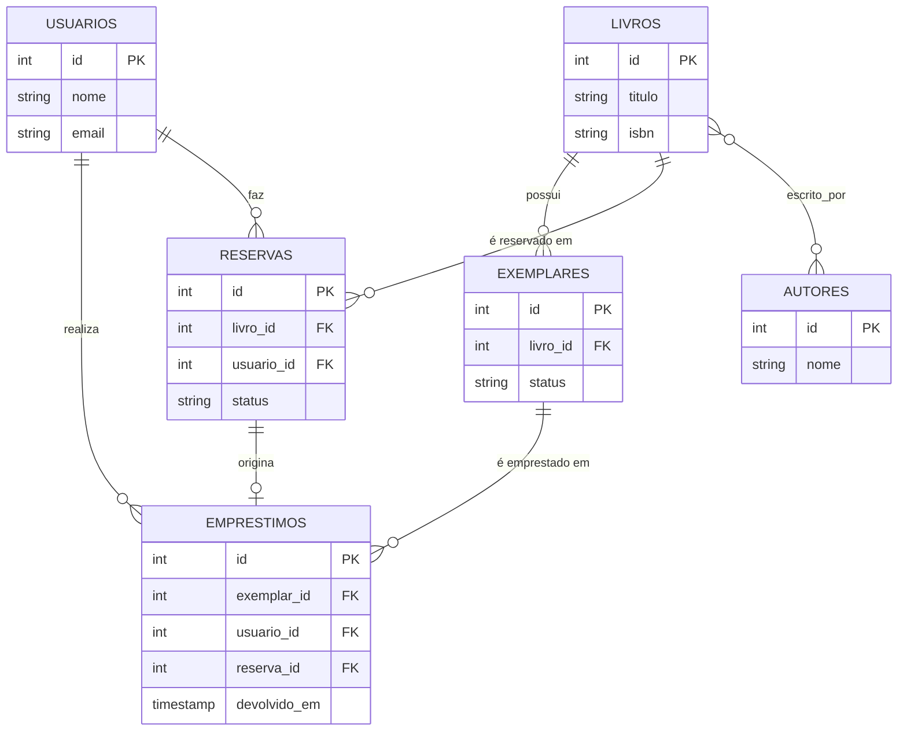

# Sistema de Empréstimo de Biblioteca

Schema relacional em PostgreSQL para uma biblioteca: catálogo de livros, exemplares
físicos, empréstimos e fila de reservas.

## Modelo de dados



## Regras garantidas pelo schema

- Um exemplar tem no máximo um empréstimo em aberto por vez (índice único parcial).
- Exemplar perdido/danificado muda de status — nunca é excluído, preservando histórico.
- Um usuário não pode ter duas reservas ativas do mesmo título.
- Livros, usuários e exemplares com histórico não podem ser excluídos (`ON DELETE RESTRICT`).

## Decisões principais

**Disponibilidade derivada, não armazenada.** Em vez de uma coluna `disponivel`, a
disponibilidade de um exemplar é calculada pela ausência de um empréstimo aberto:

```sql
CREATE UNIQUE INDEX uk_exemplar_emprestado
    ON emprestimos(exemplar_id)
    WHERE devolvido_em IS NULL;
```

**Reserva rastreável.** `emprestimos.reserva_id` (opcional) registra quando um
empréstimo veio de uma reserva atendida.

## Limitação conhecida

O schema não garante que `emprestimos.reserva_id` aponte para uma reserva do mesmo
usuário e do mesmo livro — PostgreSQL não permite `CHECK` entre tabelas. Essa
validação fica na camada de aplicação, e não em um trigger: é uma regra do fluxo de
negócio "atender reserva", não uma regra de integridade de dado.

## Testado localmente

Todas as constraints acima foram validadas com dados reais via `psql` (PostgreSQL 18.4):
reserva duplicada bloqueada, empréstimo de exemplar já emprestado bloqueado, devolução
anterior ao empréstimo bloqueada. O cenário da limitação conhecida (reserva de um
usuário usada em empréstimo de outro) foi reproduzido e confirmado — o INSERT passa
sem erro, como esperado dado que o banco não garante essa regra sozinho.

## Como executar

```bash
psql -U seu_usuario -d seu_banco -f biblioteca_schema.sql
```
